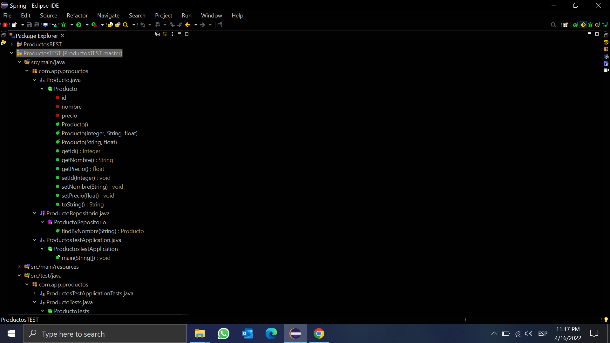
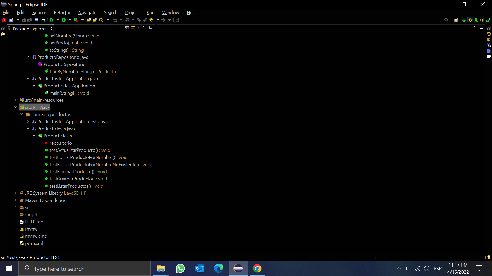
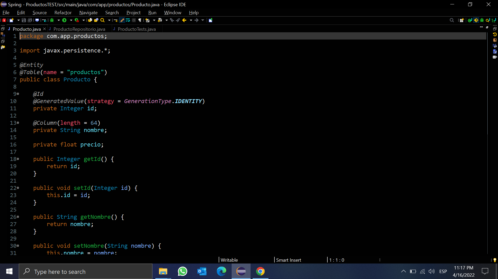
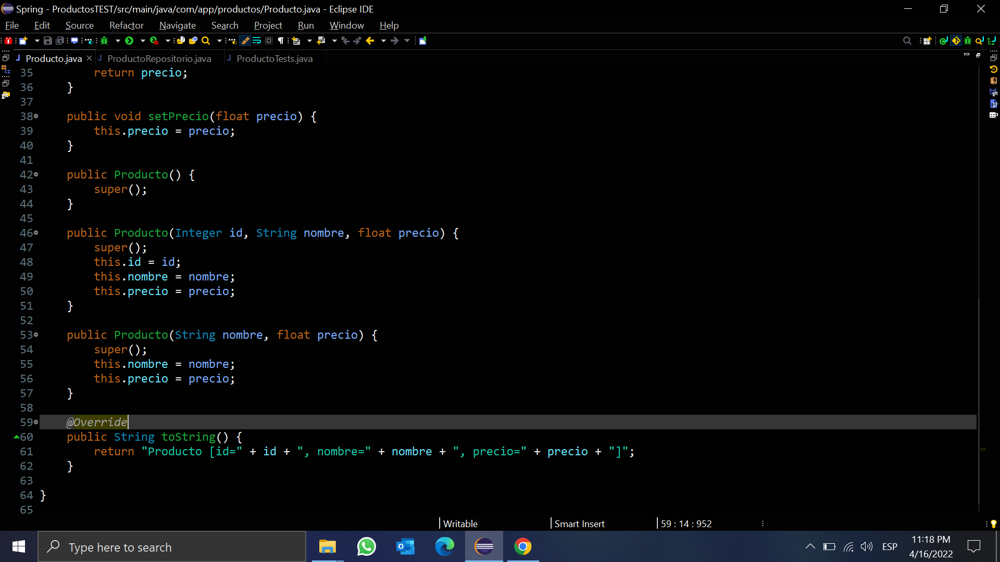
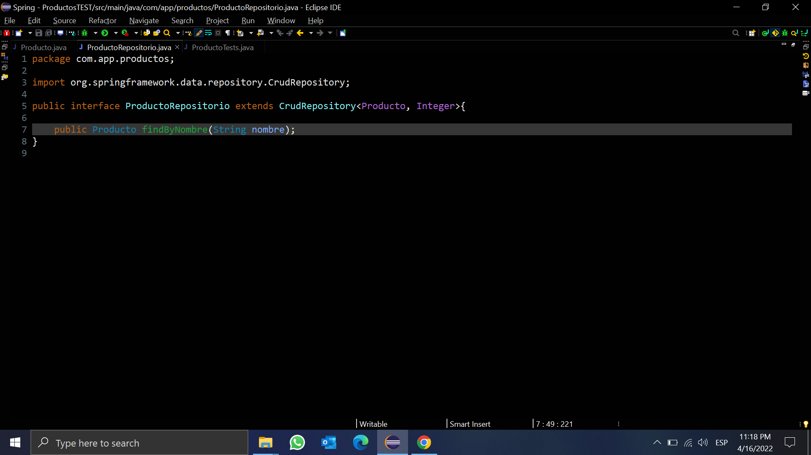
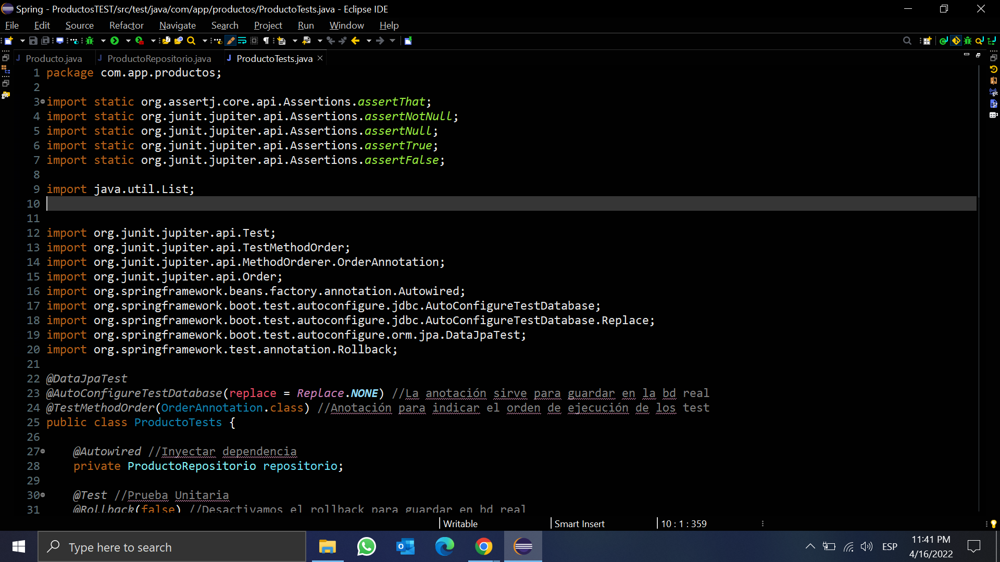
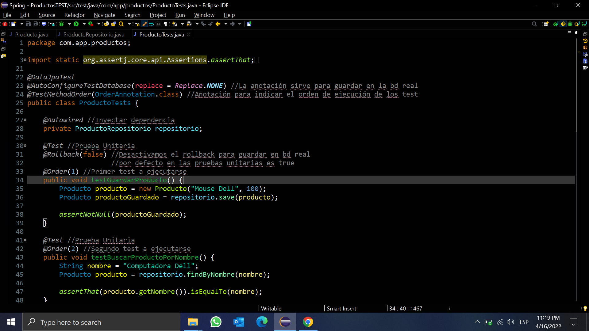
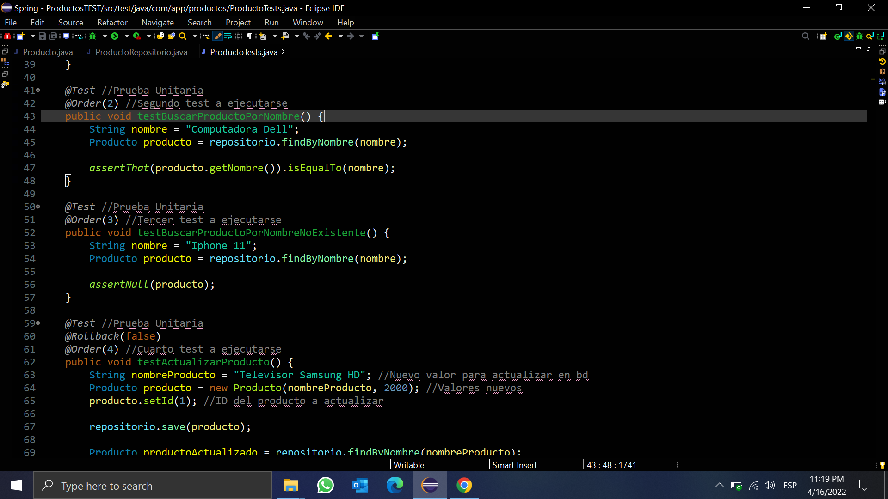
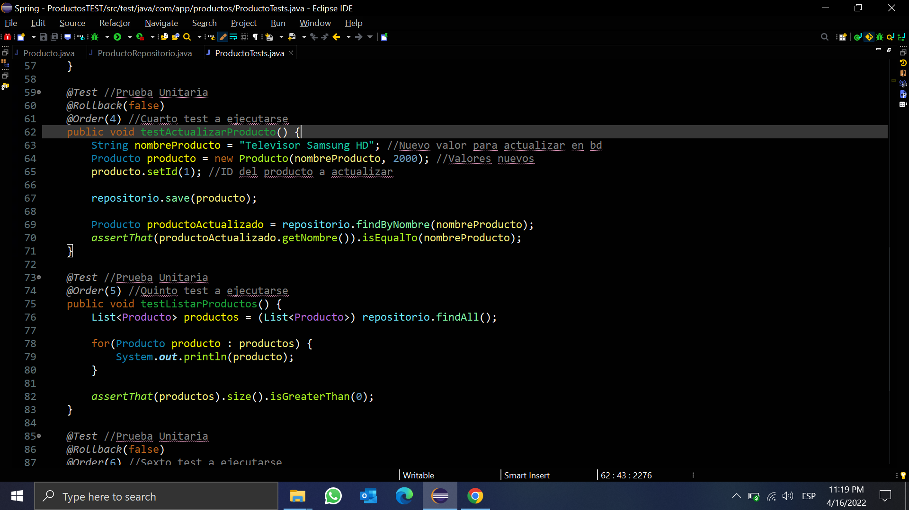
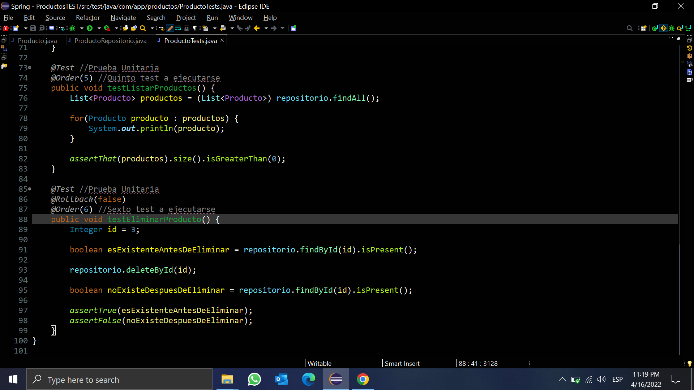

## Pruebas Unitarias con JUnit - ProductosTEST

**Organización de Carpetas del Proyecto (Eclipse)**

**Clase Producto (class)**

**Repositorio Producto (interface)**

**Pruebas Unitarias JUnit (Tests)**

